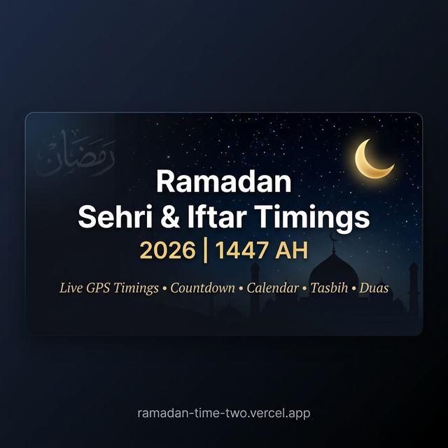

# 🌙 Ramadan Time — Sehri & Iftar Timings

<div align="center">



[](https://ramadan-time-two.vercel.app)
[](https://reactjs.org)
[](https://vitejs.dev)
[](https://tailwindcss.com)
[](./LICENSE)

**A free, beautiful Ramadan companion web app with live Sehri & Iftar timings, countdown, and spiritual tools — powered by GPS.**

</div>

---

## ✨ Features

| Feature | Description |
|---|---|
| 📍 **Live GPS Timings** | Accurate Sehri & Iftar times based on your real-time location |
| ⏱️ **Live Countdown** | Second-by-second countdown to Sehri or Iftar |
| 📅 **Monthly Calendar** | Full 30-day Ramadan schedule at a glance |
| 📿 **Digital Tasbih** | Count your dhikr (Subhan Allah, Alhamdulillah, Allahu Akbar & more) with Arabic selectors |
| 🌙 **Night of Power** | Laylat al-Qadr countdown for the last 10 odd nights |
| 📖 **Daily Duas** | Dua for Sehri, Iftar, and forgiveness |
| 😇 **Mood Duas** | Dua finder based on how you feel |
| 📊 **Zakat Calculator** | Calculate your Zakat instantly |
| ✅ **Daily Deeds** | Track prayers, fasting, taraweeh, recitation & sadaqah |
| 📚 **Quran Journey** | Track your Juz progress through the Quran |
| 💝 **Charity Jar** | Track your Ramadan Sadaqah progress |
| 🔠 **99 Names of Allah** | Browse all Asma ul Husna with Arabic & meanings |
| 📤 **Share Timings** | Share today's Sehri & Iftar timings with one tap |
| 🔌 **Offline Support** | Caches last schedule — works even without internet |

---

## 🚀 Getting Started

### Prerequisites
- Node.js 18+
- npm or yarn

### Installation

```bash
# 1. Clone the repository
git clone https://github.com/Abdullah-warraich-ch/Ramadan-Time.git
cd Ramadan-Time

# 2. Install dependencies
npm install

# 3. Set up environment variables
cp .env.example .env
# Edit .env and add your API key (see below)

# 4. Start development server
npm run dev
```

### Environment Variables

Create a `.env` file in the project root (copy from `.env.example`):

```env
VITE_API_KEY=your_islamicapi_key_here
```

> **Get your API key** from [islamicapi.com](https://islamicapi.com)

---

## 🛠️ Tech Stack

- **Framework**: [React 18](https://reactjs.org) + [Vite 5](https://vitejs.dev)
- **Styling**: [Tailwind CSS v4](https://tailwindcss.com)
- **Animations**: [Framer Motion](https://www.framer.com/motion/)
- **Icons**: [Lucide React](https://lucide.dev)
- **Fonts**: Google Fonts (Plus Jakarta Sans, Outfit, Amiri)
- **Deployment**: [Vercel](https://vercel.com)
- **API**: [islamicapi.com](https://islamicapi.com) — Location-based Ramadan timings

---

## 📁 Project Structure

```
src/
├── App.jsx                  # Main app — all pages & components
├── index.css                # Global styles & custom scrollbars
├── main.jsx                 # Entry point
├── data/
│   └── names.js             # 99 Names of Allah data
├── utils/
│   └── time.js              # Time parsing & formatting helpers
└── hooks/
    └── useRamadanData.js    # (legacy) Ramadan data hook
```

---

## 🌐 Deployment

This app is deployed on **Vercel**. To deploy your own:

```bash
# Build for production
npm run build

# Or deploy directly with Vercel CLI
npx vercel --prod
```

> **Important**: Add your `.env` variables in the Vercel dashboard under **Project Settings → Environment Variables**.

---

## 🔍 SEO

- Full Open Graph & Twitter Card meta tags
- JSON-LD structured data (WebApp, FAQ, Breadcrumb schemas)
- `sitemap.xml` and `robots.txt` included
- Covers all spelling variants: **Ramadan**, **Ramzan**, **Ramazan**
- Google Site Verification enabled

---

## 🤝 Contributing

Pull requests are welcome! For major changes, please open an issue first to discuss what you would like to change.

1. Fork the repository
2. Create your feature branch: `git checkout -b feature/amazing-feature`
3. Commit your changes: `git commit -m 'Add amazing feature'`
4. Push to the branch: `git push origin feature/amazing-feature`
5. Open a Pull Request

---

## 📄 License

This project is open source and available under the [MIT License](LICENSE).

---

<div align="center">

Made with ❤️ for Muslims everywhere | رمضان مبارك

</div>
